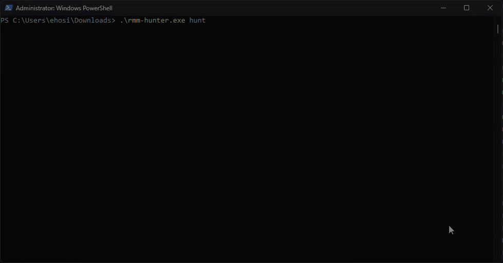
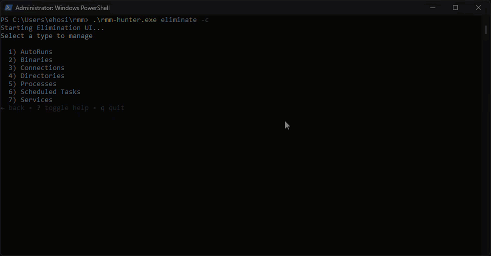
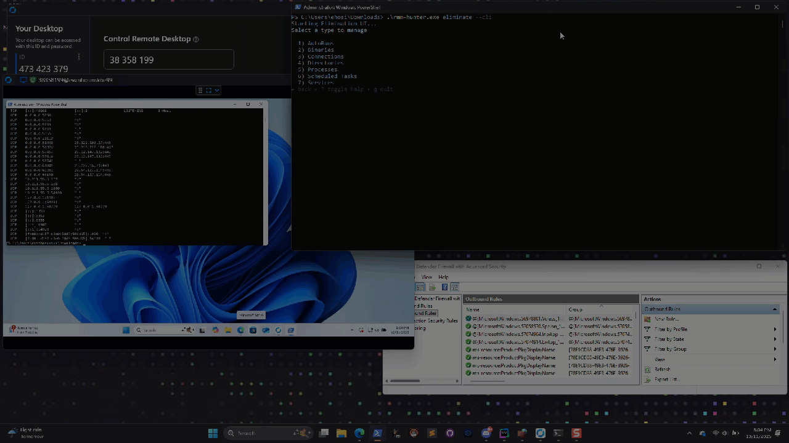
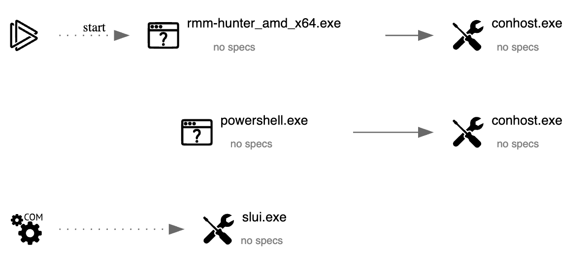

# RMM-Hunter

A comprehensive Windows security tool designed to detect and analyze Remote Monitoring and Management (RMM) software deployments.


## Overview

RMM-Hunter is an analysis tool that identifies potentially malicious or unauthorized Remote Monitoring and Management software/connections on Windows systems. Built on **Scurvy**, a custom low-level OS exploitation repository (private), RMM-Hunter provides security teams with comprehensive visibility into RMM installations that may pose security risks or compliance concerns.

## Features

### Hunt Module

The hunt module performs deep system analysis across multiple detection vectors:

- **Process Analysis** - Identifies suspicious running processes associated with known RMM tools
- **Service Enumeration** - Detects RMM-related Windows services, including those in unusual installation paths
- **Binary Discovery** - Locates RMM executables across common and uncommon installation directories
- **Registry Analysis** - Examines autorun entries and persistence mechanisms
- **Network Connection Monitoring** - Identifies active outbound connections to known RMM infrastructure
- **Scheduled Task Detection** - Discovers RMM-related scheduled tasks used for persistence
- **Directory Scanning** - Searches for RMM installation directories and artifacts



### Detection Capabilities

RMM-Hunter maintains an extensive signature database covering:

- TeamViewer, AnyDesk, LogMeIn, ScreenConnect
- Remote Utilities, UltraVNC, RealVNC, TightVNC
- Atera, NinjaRMM, ConnectWise, Syncro
- 500+ additional RMM tools and variants

The tool implements intelligent filtering to reduce false positives while flagging suspicious installation paths and configurations.

### Reporting

RMM-Hunter generates comprehensive reports in multiple formats:

- **JSON** - Machine-readable format for integration with SIEM and automation platforms
- **HTML** - Interactive web-based report with filtering and search capabilities

The HTML report includes:
- Executive summary with detection statistics
- Detailed findings across all detection categories
- Metadata including detection time and system information
- Built-in search and filter functionality for large result sets


## Installation

### Prerequisites

- Windows Operating System (Windows 10/11 or Windows Server 2016+)
- Administrator privileges (required for service and process enumeration)
- Go 1.24+ (for building from source)

### Binary Download

Download the latest compiled binary from the releases page:
```powershell
Download rmm-hunter.exe
Run with administrator privileges
```

### Building from Source

The Scurvy Library is not publicly accessible making building this tool from source impossible at the moment.

## Usage

### Hunt Mode

Execute a comprehensive system scan:

```powershell
powershell .\rmm-hunter.exe hunt
```

With custom output file:

```powershell
powershell .\rmm-hunter.exe hunt --output custom-report.json
``` 

Exclude specific RMM tools from detection:
```powershell
powershell .\rmm-hunter.exe hunt --exclude TeamViewer,AnyDesk
```

### Eliminate Mode

The elimination module provides an interactive command-line interface for removing detected RMM installations from your system. The CLI component is fully functional, while the web-based interface is currently under development.

#### CLI Component

Launch the interactive CLI elimination interface:

```powershell
powershell .\rmm-hunter.exe eliminate --cli
```

The CLI component operates through a multi-stage interactive workflow designed to provide granular control over the elimination process. When launched, the interface guides you through the following stages:

**Stage 1: Report Selection**

The interface scans the current directory for JSON hunt reports and presents them in a navigable list. You can browse available reports using arrow keys and select one by pressing Enter. The file picker automatically filters for valid JSON files generated by previous hunt operations.

**Stage 2: Category Selection**

After loading a report, you are presented with seven elimination categories corresponding to the detection vectors from the hunt module. Each category is accessible via numeric keys (1-7):

1. AutoRuns - Registry-based persistence mechanisms
2. Binaries - Executable files on disk
3. Connections - Active network connections
4. Directories - Installation directories
5. Processes - Running processes
6. Scheduled Tasks - Task Scheduler entries
7. Services - Windows services

**Stage 3: Item List View**

Upon selecting a category, the interface displays all detected items within that category. Each item shows relevant identifying information such as process names, file paths, service names, or connection details. Items that have already been eliminated are marked with a checkmark and displayed in green to provide visual feedback on remediation progress. You can navigate through the list using arrow keys and select an item for detailed inspection by pressing Enter.

**Stage 4: Detail View and Elimination**

The detail view presents comprehensive information about the selected item, including all metadata collected during the hunt phase. For each item type, the interface displays specific details:

For processes, you see the process name, PID, parent PID, command-line arguments, creation time, and executable path. For services, the display includes service name, display name, service type, start type, binary path, start account, and description. For autoruns, you see the entry name, launch string, registry location, image path, arguments, and file hashes (MD5, SHA1, SHA256). For binaries and directories, the full path is shown. For network connections, local and remote addresses, remote hostname, connection state, associated PID, and process name are displayed. For scheduled tasks, the name, author, state, enabled status, last result, next run time, last run time, and task path are presented.

From the detail view, pressing the exclamation mark (!) key initiates the elimination process for that specific item. The system performs intelligent dependency checking before elimination to prevent system instability.

**Dependency Validation**

Before eliminating binaries or directories, the system checks whether any active processes or enabled services are currently using those resources. If a dependency is detected, a warning modal appears explaining the conflict and suggesting the proper elimination order. For example, if you attempt to delete a binary that is currently in use by a running process, the system will warn you to eliminate the process first. Similarly, if a directory contains binaries used by active services, you must stop and remove those services before the directory can be deleted.



**Elimination Actions**

Each category type performs specific elimination operations:

Processes are terminated using their PID. Services are stopped and then deleted from the service control manager. Binaries are removed from the filesystem. Directories are recursively deleted along with all contents. AutoRun entries are removed from their respective registry locations. Scheduled tasks are disabled and then deleted from the Task Scheduler. Network connections result in the creation of Windows Firewall outbound block rules for the remote host, preventing future connections to that destination.



**State Persistence**

After each successful elimination, the system updates the JSON report file to mark the item as eliminated. This ensures that if you exit and restart the elimination interface, previously eliminated items remain marked and visually distinguished. The persistent state allows you to work through large result sets across multiple sessions without losing track of your progress.

**Navigation**

Throughout the interface, you can navigate backward using the left arrow key to return to the previous screen. Pressing 'q', 'Esc', or 'Ctrl+C' at any point will exit the application. The interface provides contextual help at each stage, displaying available keyboard shortcuts and actions.

#### Web Component (Under Development)

The web-based elimination interface is planned for a future release and will provide browser-based remediation capabilities with enhanced visualization and reporting features.

```powershell
powershell .\rmm-hunter.exe eliminate --web
```

This functionality is not yet available.

## Architecture

RMM-Hunter is built on **Scurvy**, a custom low-level OS exploitation repository (private). Scurvy provides the core capabilities for low-level Windows API interactions, process and service management, registry operations, network connection enumeration, and WMI query execution. The modular architecture allows for extensible detection capabilities while maintaining performance and stability.

## Output Formats

### JSON Report

json { "processes": [...], "services": [...], "binaries": [...], "autoRuns": [...], "scheduledTasks": [...], "outboundConnections": [...], "directories": [...] }``` 

### HTML Report

Interactive web-based report with:
- Sortable tables
- Real-time search filtering
- Category-based navigation
- Responsive design for mobile viewing

## Detection Methodology

RMM-Hunter employs multiple detection strategies:

1. **Signature-based Detection** - Matches against known RMM executable names and paths
2. **Behavioral Analysis** - Identifies suspicious installation locations and configurations
3. **Network Indicators** - Detects connections to known RMM infrastructure domains
4. **Persistence Mechanisms** - Analyzes autorun entries and scheduled tasks

## Limitations

Requires administrative privileges for complete system visibility. May generate false positives in environments with legitimate RMM deployments. Network detection requires active connections at scan time. The web-based elimination interface is not yet available.

## Contributing

Contributions are welcome. Please submit pull requests with detailed descriptions of changes, test coverage for new detection signatures, and documentation updates.

## License

This project is licensed under the MIT License - see the [LICENSE](LICENSE) file for details.

### Attribution

If you use RMM-Hunter in your project or research, please provide attribution by including:
- A link back to this repository: `https://github.com/KrakenTech/RMM-Hunter`
- Credit to **KrakenTech LLC** (https://krakensec.tech)

Example attribution:
```txt
This project uses RMM-Hunter by KrakenTech LLC
https://github.com/KrakenTech/RMM-Hunter
```

## Disclaimer

This tool is intended for authorized security assessments and forensic analysis only. Users are responsible for ensuring compliance with applicable laws and regulations. Unauthorized use of this tool may violate computer fraud and abuse laws.

## Support

For issues, questions, or feature requests, please open an issue on the GitHub repository.

**Note**: The underlying Scurvy repository is a custom low-level OS exploitation framework that is not publicly accessible and is maintained privately.

## Any.Run Submission
v1.2.0: https://app.any.run/tasks/03b6afcd-308c-4056-bafc-e6514185d922


