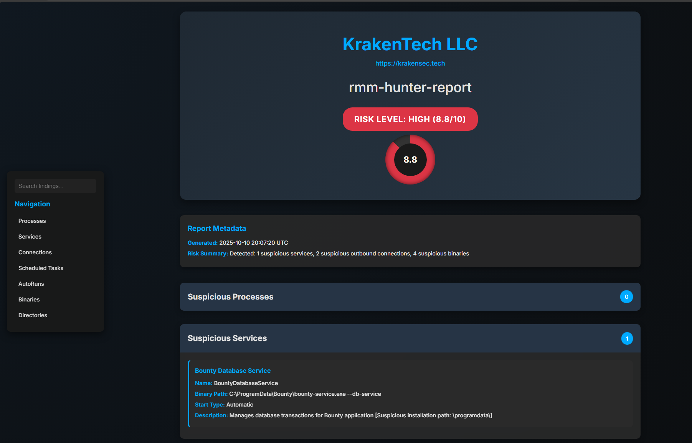
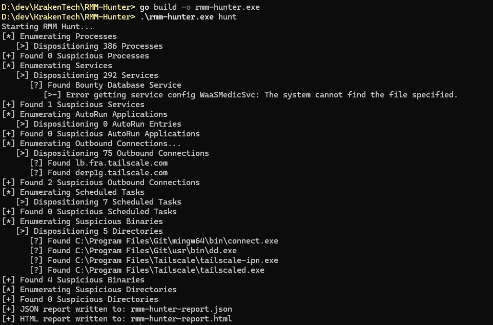
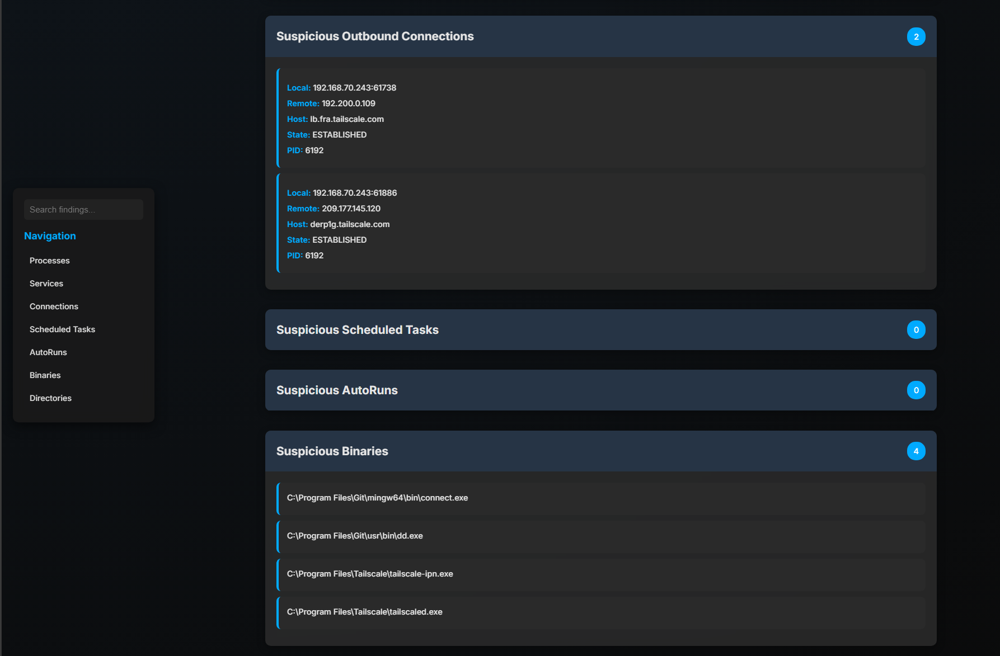
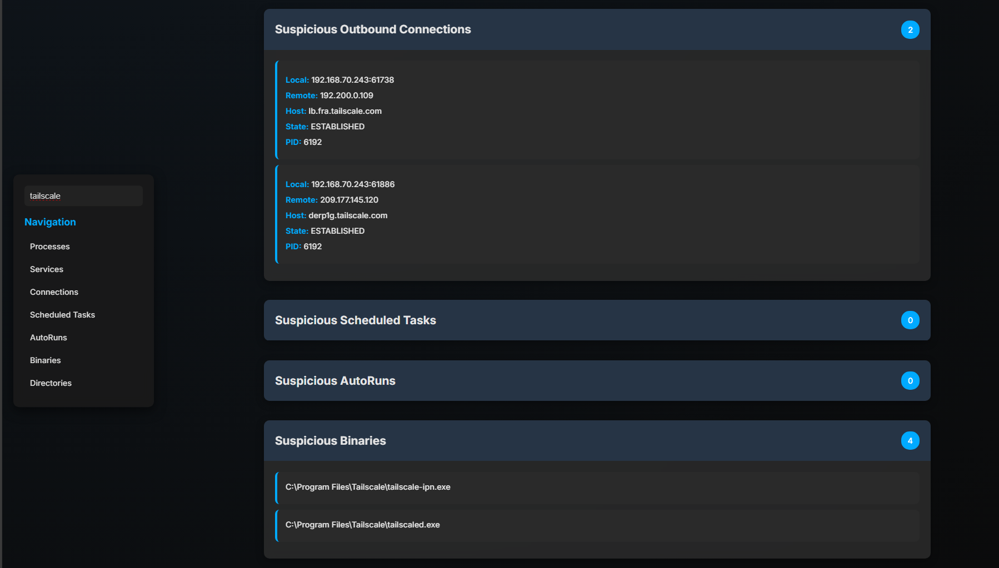

# RMM-Hunter

A comprehensive Windows security tool designed to detect and analyze Remote Monitoring and Management (RMM) software deployments across enterprise environments.



## Overview

RMM-Hunter is a forensic analysis tool that identifies potentially malicious or unauthorized Remote Monitoring and Management software on Windows systems. Built on a proprietary detection framework called **Scurvy** (private repository), RMM-Hunter provides security teams with comprehensive visibility into RMM installations that may pose security risks or compliance concerns.

## Features

### Hunt Module

The hunt module performs deep system analysis across multiple detection vectors:

- **Process Analysis** - Identifies suspicious running processes associated with known RMM tools
- **Service Enumeration** - Detects RMM-related Windows services, including those in unusual installation paths
- **Binary Discovery** - Locates RMM executables across common and uncommon installation directories
- **Registry Analysis** - Examines autorun entries and persistence mechanisms
- **Network Connection Monitoring** - Identifies active outbound connections to known RMM infrastructure
- **Scheduled Task Detection** - Discovers RMM-related scheduled tasks used for persistence
- **Directory Scanning** - Searches for RMM installation directories and artifacts



### Detection Capabilities

RMM-Hunter maintains an extensive signature database covering:

- TeamViewer, AnyDesk, LogMeIn, ScreenConnect
- Remote Utilities, UltraVNC, RealVNC, TightVNC
- Atera, NinjaRMM, ConnectWise, Syncro
- 500+ additional RMM tools and variants

The tool implements intelligent filtering to reduce false positives while flagging suspicious installation paths and configurations.

### Reporting

RMM-Hunter generates comprehensive reports in multiple formats:

- **JSON** - Machine-readable format for integration with SIEM and automation platforms
- **HTML** - Interactive web-based report with filtering and search capabilities



The HTML report includes:
- Executive summary with detection statistics
- Detailed findings across all detection categories
- Metadata including detection time and system information
- Built-in search and filter functionality for large result sets



## Installation

### Prerequisites

- Windows Operating System (Windows 10/11 or Windows Server 2016+)
- Administrator privileges (required for service and process enumeration)
- Go 1.24+ (for building from source)

### Binary Download

Download the latest compiled binary from the releases page:
```

powershell
Download rmm-hunter.exe
Run with administrator privileges```

### Building from Source
```

The Scurvy Library is not publicly accessible making building this tool from source impossible at the moment.

## Usage

### Hunt Mode

Execute a comprehensive system scan:
```powershell
powershell .\rmm-hunter.exe hunt
```

With custom output file:

powershell .\rmm-hunter.exe hunt --output custom-report.json``` 

Exclude specific RMM tools from detection:
```powershell
powershell .\rmm-hunter.exe hunt --exclude TeamViewer,AnyDesk
```

### Eliminate Mode

**Status: Under Construction**

The elimination module is currently under active development. This functionality will provide automated remediation capabilities for detected RMM installations.

Planned features:
- Service termination and removal
- Process termination
- Binary deletion
- Registry cleanup
- Scheduled task removal
- Backup and rollback capabilities

## Architecture

RMM-Hunter is built on **Scurvy**, a proprietary Windows system analysis framework (private repository). Scurvy provides the core capabilities for:

- Low-level Windows API interactions
- Process and service management
- Registry operations
- Network connection enumeration
- WMI query execution

The modular architecture allows for extensible detection capabilities while maintaining performance and stability.

## Output Formats

### JSON Report

json { "processes": [...], "services": [...], "binaries": [...], "autoRuns": [...], "scheduledTasks": [...], "outboundConnections": [...], "directories": [...] }``` 

### HTML Report

Interactive web-based report with:
- Sortable tables
- Real-time search filtering
- Category-based navigation
- Responsive design for mobile viewing

## Detection Methodology

RMM-Hunter employs multiple detection strategies:

1. **Signature-based Detection** - Matches against known RMM executable names and paths
2. **Behavioral Analysis** - Identifies suspicious installation locations and configurations
3. **Network Indicators** - Detects connections to known RMM infrastructure domains
4. **Persistence Mechanisms** - Analyzes autorun entries and scheduled tasks

## Limitations

- Requires administrative privileges for complete system visibility
- May generate false positives in environments with legitimate RMM deployments
- Network detection requires active connections at scan time
- Elimination functionality not yet available

## Contributing

Contributions are welcome. Please submit pull requests with:
- Detailed description of changes
- Test coverage for new detection signatures
- Documentation updates

## License

This project is licensed under the MIT License - see the [LICENSE](LICENSE) file for details.

### Attribution

If you use RMM-Hunter in your project or research, please provide attribution by including:
- A link back to this repository: `https://github.com/KrakenTech/RMM-Hunter`
- Credit to **KrakenTech LLC** (https://krakensec.tech)

Example attribution:
```txt
This project uses RMM-Hunter by KrakenTech LLC
https://github.com/KrakenTech/RMM-Hunter
```

## Disclaimer

This tool is intended for authorized security assessments and forensic analysis only. Users are responsible for ensuring compliance with applicable laws and regulations. Unauthorized use of this tool may violate computer fraud and abuse laws.

## Support

For issues, questions, or feature requests, please open an issue on the GitHub repository.

---

**Note**: The underlying Scurvy framework is not publicly accessible and is maintained in a private repository.

